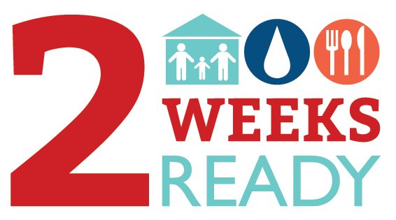
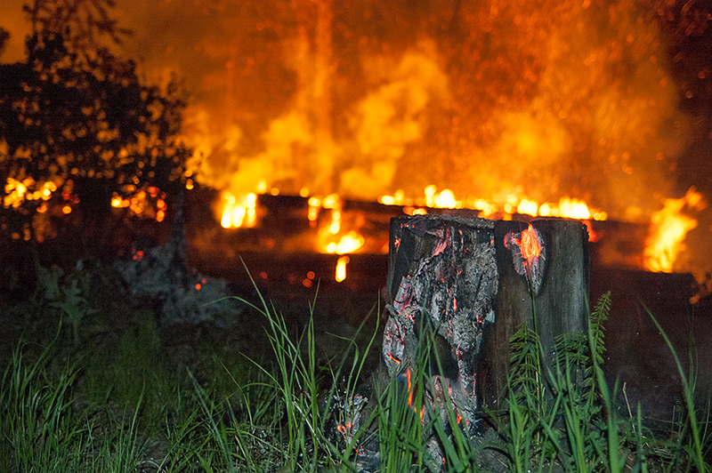

# 2 Weeks Ready

For many years, we’ve been talking about the importance of being prepared for 72 hours. This is a good start, and helpful in the event of short-term power outages or temporary evacuation. But a large earthquake and tsunami will leave much of the area’s transportation routes destroyed. Oregonians will have to count on each other in the community, in the workplace and at home in order to be safe until responders can reach you.

**Use this application as a means to prepare to become two weeks ready.**

Are you prepared? Do you have a plan for your home, your family, and your loved ones?

