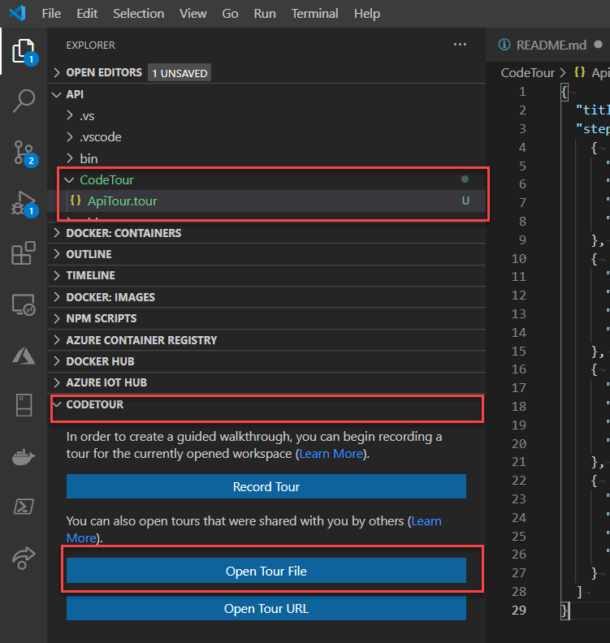

# TwoWeeksReady API

[](https://github.com/HTBox/TwoWeeksReady/actions?query=workflow%3A"Api+CI%2FCD")

## Prerequisites

[.NET Core SDK 3.1](https://dotnet.microsoft.com/download)

[Azure Functions Core Tools 3](https://docs.microsoft.com/en-us/azure/azure-functions/functions-run-local?tabs=windows%2Ccsharp%2Cbash#install-the-azure-functions-core-tools)

  `npm i -g azure-functions-core-tools@3 --unsafe-perm true`

### Using VS Code

Open the `api.code-workspace` in VS Code.

### Using Visual Studio 2019

Open the `api.sln` in Visual Studio 2019.

### Setup Azure CosmosDB

For local development, you can run the [Azure Cosmos DB Emulator](https://docs.microsoft.com/azure/cosmos-db/local-emulator) if you are developing on Windows. If not, you will need to create a CosmosDB instance in your own Azure account. You can use the [Azure ComsoDB Free Tier](https://docs.microsoft.com/azure/cosmos-db/optimize-dev-test#azure-cosmos-db-free-tier)

You will also need to create a SQL API database named **2wr** and the following containers:

| Container | Partition Key |
|-----------|---------------|
| basekits  | /id           |
| emergencykits | /userId   |
| hazardinformation | /id |
| hazardhunts | /id |
| familyplan | /userId |

### Create a local.settings.json

Create a `local.settings.json` file in the TwoWeeksReady project folder. You will need to set the CosmosDbConnection setting to your own CosmosDB instance.

```Javascript
{
  "IsEncrypted": false,
  "Values": {
    "FUNCTIONS_WORKER_RUNTIME": "dotnet",
    "OidcApiAuthSettings:Audience": "https://2wrdev.azurewebsites.net",
    "OidcApiAuthSettings:IssuerUrl": "https://dev-3y6ze-l0.us.auth0.com/"
  },
  "ConnectionStrings": {
    "CosmosDBConnection": "AccountEndpoint=https://localhost:8081/;AccountKey=YOURLOCALACCOUNTKEY"
  },
  "Host":{
    "CORS": "*"
  }
}
```

## CodeTour Onboarding

In VSCode, you can get a walk-through of the code via the [CodeTour](https://marketplace.visualstudio.com/items?itemName=vsls-contrib.codetour) extension. Install this extension, and review tours available in the 'CodeTour' folder.



## Development Workflow

### Compile

``` console
dotnet build
```

### Run from the command line

``` console
func start --build
```

### Debug from VS Code menu

F5

